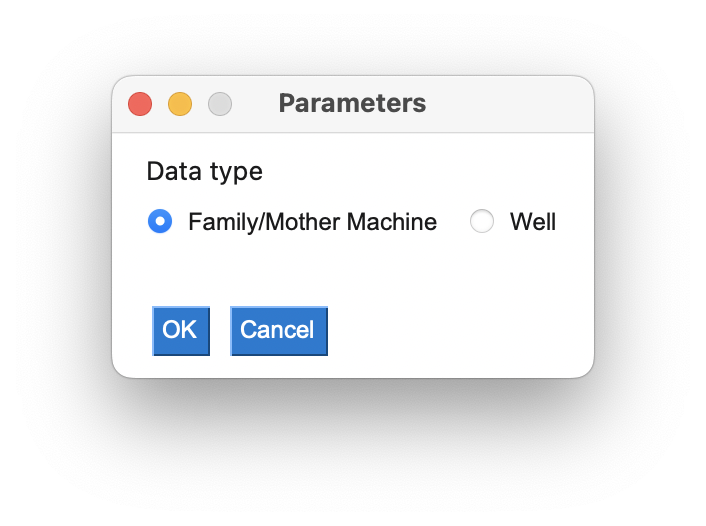
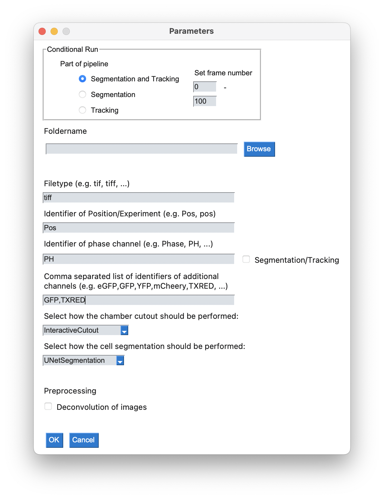

# MIDAP

## Installation on Mac and Linux

The installation was tested on macOS Big Sur (11.6.7), Ubuntu 22.04 and WSL II on Win 11.

1. Clone the repo, navigate to the directory containing the pipeline `cd midap` and download model weights and example files from polybox `./download_files.sh`.

2. Create the virtual environment:

    1. **For Macs with an M1 chip:**

       If you are not sure if your Mac has an M1 chip, open a terminal an run
       ```
       if [[ ${OSTYPE} = darwin* ]] && [[ $(uname -m) == "arm64" ]]; then echo "M1"; fi 
       ```
       if it prints "M1" in your terminal, install Miniforge via `./install_miniforge.sh` and proceed to step 3, otherwise proceed with step 2.2.

    
    2.  **For Linux and older Macs:**
    
        You can create a conda environment with: `conda env create -f environment.yml` and then activate it via

         ```
         conda activate midap
         ```

3. Navigate to the bin directory with `cd bin/`. You can start the pipeline from the command line with `./run_pipeline.sh`. The script accepts arguments and has the following signature:

```
Syntax: run_pipeline.sh [options]

Options:
 -h, --help         Display this help
 --restart [PATH]   Restart pipeline from log file. If PATH is specified
                    the checkpoint and settings file will be restored from
                    PATH, otherwise the current working directory is searched
 --headless         Run pipeline in headless mode (no GUI)
 --loglevel         Set logging level of script (0-7), defaults to 7 (max log)
```
Note that the `--headless` option currently only skips the first GUI and expects that a `settings.sh` is provided in the working directory.

## Installation on the Euler cluster

1. **[Mac only]**: Install [XQuartz](https://www.xquartz.org/) for X11 support (GUI forwarding from Euler) and start the software.

2. Log into Euler with activated X11 forwarding: `ssh -X <username>@euler.ethz.ch`

3. Clone the repo, navigate to the directory containing the pipeline `cd midap` and download model weights and example files from polybox `./download_files.sh`.

4. Navigate to the Euler directory in the repo `cd ./euler` and create the virtual environment
```
./create_venv.sh
```

5. Source the environment

```
source source_venv.sh
```
This step has to be **repeated everytime you log into Euler before starting the pipeline**. If you want this to happen automatically add the following line 
to your `$HOME/.bash_profile`:
```
source <path/to/your>/source_venv.sh
```
where you fill in the absolute path to your source file.

6. Navigate to the bin and start an interactive job with X11 forwarding
```
cd ../bin/
bsub -XF -n 8 -R "rusage[ngpus_excl_p=1]" -Is bash
```

7. After the job starts you can run the pipeline in the same way as on your local machine (see step 6 above)

## User Guide

### Pipeline
1. Start pipeline as described above.

2. Select the data type<br/>
<br>

3. In case of family or mother machine, please select/add:
- the **part of the pipeline** you want to run
- the **frame numbers** to be analyzed
- **path** to the folder containing the data (tiff-stacks)
- **filetype** of the input files
- **identifiers** of position/experiment
- a comma separated **list of additional channels**
- [optional] **modified methods** for chamber cutout and segmentation (more information: [Modularity](#modularity-of-the-pipeline))
- whether **deconvolution** of the raw images should be applied.<br/>
<br>
The pipeline requires grayscale tiff-stacks as input files.
By default the phase images are not segmented. In case you would like to do cell segmentation and tracking for your phase images, place click the box next to the respective field.
**Please note:** all input fields are case sensitive!

### Manual correction and visuallization of results

The scripts for manual correction and visualization use the Python package napari. To use these scripts, a new environment has to be created:

```
conda create -y -n napari-env -c conda-forge python=3.9
conda activate napari-env
python -m pip install "napari[all]"
```

#### Manual correction of segmentations
The manual correction can be started with the following commands:
```
cd bin/
python correct_segmentation.py --path_img PATH_IMG --path_seg PATH_SEG_IMG
```

The arguments PATH_IMG and PATH_SEG_IMG are passed as strings and should contain the full path name (e.g. '/Users/Documents/data/img_1.tif').

#### Visualization of tracking results
```
cd bin/
python visualize_lineages.py --path ../example_data/Glen/{Position}/{Channel}/track_output/
```

### Modularity of the Pipeline

It is possible to define custom methods for the chamber cutout, the cell segmentation and the tracking. 

#### Chamber cutout

To define a custom method for the chamber cutout, you can start by copying the `interactive_cutout.py` file in the `midap` package:

```
cd midap/imcut
cp interactive_cutout.py <your_filename>.py
```
In the copied file, change the name of the class from `InteractiveCutout` to your own class. Choose a descriptive name as the name of this class will be shown in the dropdown menu of the GUI to select the method. Then you can overwrite the `cut_corners` method with your own method. Note that you should not add additional arguments to the method and the method has to set the attribute `self.corners_cut` the cutout corners.

#### Cell Segmentation

To define a custom method for the cell segmentation, you can start by copying the `unet_segmentator.py` file in the `midap` package:

```
cd midap/segmentation
cp unet_segmentator.py <your_filename>.py
```
In the copied file, change the name of the class from `UNetSegmentation` to your own class. Choose a descriptive name as the name of this class will be shown in the dropdown menu of the GUI to select the method. Then you can overwrite the `set_segmentation_method` method with your own method. Note that you should not add additional arguments to the method and the method has to set the attribute `self.segmentation_method` to a method that performs the cell segmentation.

#### Tracking

To be added...

