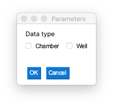
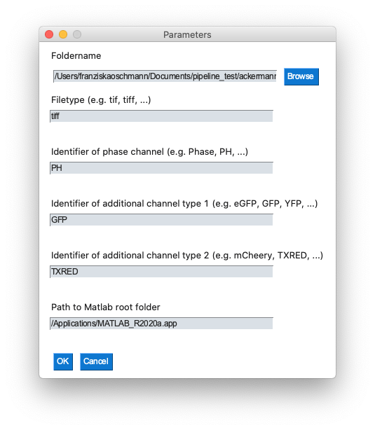

### Setup on local machine (Mac)
#### 1. Initialization and update of submodule (SuperSeggar)
```
git submodule init
git submodule update
```

#### 2. Setup of environment
```
conda env create -f environment_mac.yml
```

#### 3. Navigate to bin-directory and mark bash-script as executable
```
cd bin/
chmod +x run_pipeline_local.sh
```

### Run pipeline on local machine
#### 1. Navigate to bin-directory and activate conda environment
```
cd bin/
conda activate workflow
```

#### 2. Execute pipeline
```
./run_pipeline_local.sh
```

#### 3. Select data type, folder path and identifiers of input files via GUI

1. Select the data type


2. In case of chambers, select folder path, identifiers of input files and Matlab root folder


3. The matlab root folder can be found with the following Matlab-command:
```
matlabroot
```
