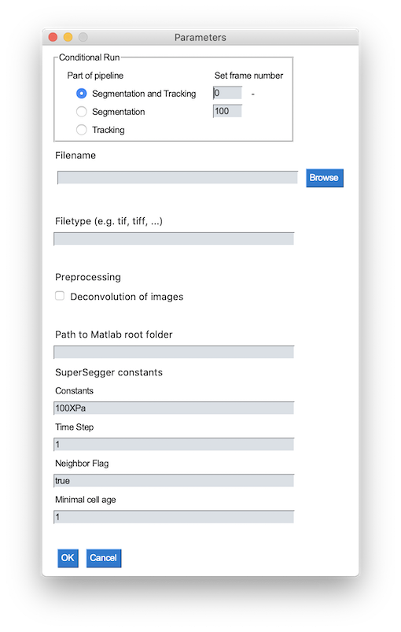

### Setup on local machine (Mac)
#### 1. Initialization and update of submodule (SuperSegger)
```
git submodule init
git submodule update
```

#### 2. Setup of environment
```
conda env create -f environment_mac.yml
```

#### 3. Navigate to bin-directory and mark bash-script as executable
```
cd bin/
chmod +x run_pipeline_test.sh
```

### Run pipeline on local machine
#### 1. Navigate to bin-directory and activate conda environment
```
cd bin/
conda activate workflow
```

#### 2. Execute pipeline
```
./run_pipeline_test.sh
```

#### 3. Select data type, folder path and identifiers of input files via GUI

1. Select the data type<br/>
<br/>

2. In case of family or mother machine, select the part of the pipeline you want to run, the frame numbers to restrict the analysis to, the folder path, identifiers of input files, identifiers of position/experiment and whether you want to deconvolve the raw images.
<br/>
The pipeline requires grayscale tiff-stacks as input files.
If only one or two out of three channels were used, specify only the identifiers of those channels and leave the other fields free. By default the phase images are not segmented. In case you would like to do cell segmentation and tracking for your phase images, place click the box next to the respective field.
**Please note:** all input fields are case sensitive!
3. In case of well plates, select the part of the pipeline you want to run, the frame numbers to restrict the analysis to, the file name and whether you want to deconvolve the raw images.
<br/>

#### 4. Visualization of tracking results
```
cd bin/
python visualize_lineages.py --path ../example_data/Glen/{Position}/{Channel}/track_output/
```

